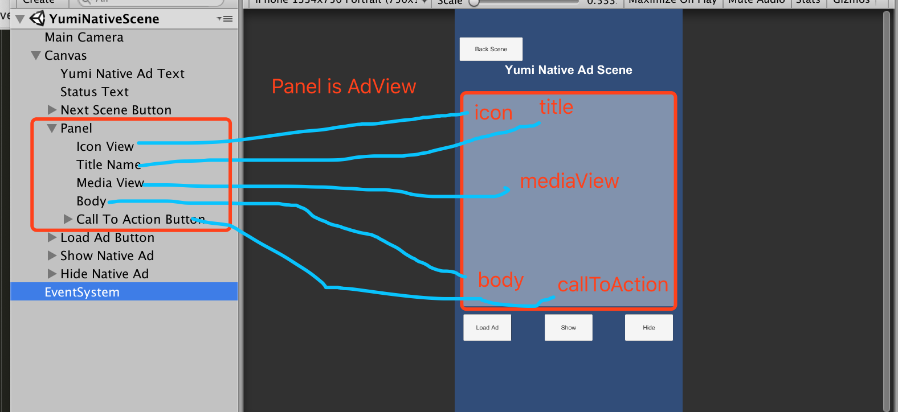

[TOC]

## YumiAdSDK Unity  plugins API

### Banner

1. 初始化构造方法：

   ```c#
   public YumiBannerView(string placementId, string channelId, string versionId, YumiBannerViewOptions bannerOptions)
   ```
   YumiBannerViewOptions 可以配置如下信息：

   ```c#
   // banner position in supview
   internal YumiAdPosition adPosition;
   internal YumiBannerAdSize bannerSize;
   // If isSmart is set to YES, it will render screen-width banner ads on any screen size across different devices in either orientation.
   internal bool isSmart;
   // Disable auto refresh for the YumiMediationBannerView instance.
   internal bool disableAutoRefresh;
   ```

2. 请求 Banner

   ```c#
   public void LoadAd(bool isSmart)   
   ```

3. 展示 Banner

   ```c#
    public void Show()
   ```

4. 隐藏 Banner

   ```c#
   public void Hide()
   ```

5. 销毁 Banner

   ```c#
   public void Destroy()
   ```

6. 回调方法

   ```c#
   // Ad event fired when the banner ad has loaded.
   public event EventHandler<EventArgs> OnAdLoaded;
   // Ad event fired when the banner ad has failed to load.
   public event EventHandler<YumiAdFailedToLoadEventArgs> OnAdFailedToLoad;
   // Ad event fired when the banner ad is click.
   public event EventHandler<EventArgs> OnAdClick;
   ```

### Interstitial

1. 初始化构造方法

   ```c#
   public YumiInterstitialAd(string placementId, string channelId, string versionId)   
   ```

2. 判断 Interstitial 是否准备好

   ```c#
   public bool IsReady()
   ```

3. 展示 Interstitial

   ```c#
   public void Show()
   ```

4. 销毁 Interstitial

   ```c#
   public void Destroy()
   ```

5. 回调方法

   ```c#
   //Ad event fired when the interstitial ad has loaded.
   public event EventHandler<EventArgs> OnAdLoaded;
   // Ad event fired when the interstitial ad has failed to load.
   public event EventHandler<YumiAdFailedToLoadEventArgs> OnAdFailedToLoad;
   // Ad event fired when the interstitial ad is closed.
   public event EventHandler<EventArgs> OnAdClosed;
   // Ad event fired when the interstitial ad is clicked.
   public event EventHandler<EventArgs> OnAdClicked;

   ```

### Reward video

1. 初始化构造方法(单例对象)

   ```c#
   public static YumiRewardVideoAd Instance
   ```

2. 请求 Reward video

   ```C#
   public void LoadAd(string placementId, string channelId, string versionId)
   ```

3. 判断 Reward video 是否准备好

   ```c#
   public bool IsReady()
   ```

4. 播放 Reward video

   ```c#
   public void Play()
   ```

5. 销毁 Reward video

   ```c#
   public void Destroy()
   ```

6. 回调方法

   ```c#
   // Ad event fired when the reward based video ad is opened.
   public event EventHandler<EventArgs> OnAdOpening;
   // Ad event fired when the reward based video ad has started playing.
   public event EventHandler<EventArgs> OnAdStartPlaying;
   // Ad event fired when the reward based video ad has rewarded the user.
   public event EventHandler<EventArgs> OnAdRewarded;
   // Ad event fired when the reward based video ad is closed.
   public event EventHandler<EventArgs> OnAdClosed;
   ```

### Native

1. 初始化构造方法

   ```c#
   public YumiNativeAd(string placementId, string channelId, string versionId, YumiNativeAdOptions options)
   ```

   YumiNativeAdOptions 可以配置原生广告显示的样式，参数详情如下：

   ```c#
   internal AdOptionViewPosition adChoiseViewPosition;// AdOptionViewPosition 包括：       TOP_LEFT,TOP_RIGHT,BOTTOM_LEFT,BOTTOM_RIGHT
   internal AdAttribution adAttribution;//AdAttribution 包括：AdOptionsPosition、text、textColor、backgroundColor、textSize、hide
   internal TextOptions titleTextOptions;//TextOptions 包括：textSize，textColor，backgroundColor
   internal TextOptions descTextOptions;
   internal TextOptions callToActionTextOptions;
   internal ScaleType iconScaleType;
   internal ScaleType coverImageScaleType; // ScaleType: SCALE_TO_FILL、SCALE_ASPECT_FIT 、 SCALE_ASPECT_FILL
   ```

2. 请求 Native

   ```c#
   public void LoadAd(int adCount)
   ```

3. 注册（添加） Unity 展示元素 

   ```C#
   public void RegisterGameObjectsForInteraction(YumiNativeData data, GameObject gameObject, Dictionary<NativeElemetType, Transform> elements)
   ```

   elements 是一个字典，用于传入原生素材的 Transform，key值是NativeElemetType，NativeElemetType值如下所示：

   ```c#
   PANEL, //adView
   TITLE,
   DESCRIPTION,
   ICON,
   COVER_IMAGE,
   CALL_TO_ACTION
   ```

4. 判断广告素材是否有效 (有没有过期)

   ```c#
   public bool IsAdInvalidated(YumiNativeData nativeData)
   ```

5. 展示 Native view

   ```c#
   public void ShowView(YumiNativeData nativeData)
   ```

6. 隐藏 Native View

   ```c#
   public void HideView(YumiNativeData nativeData)
   ```

7. 移除 Native View

   ```c#
   public void UnregisterView(YumiNativeData nativeData)
   ```

8. 销毁 Native

   ```c#
   public void Destroy()
   ```

9. 回调方法

   ```c#
   // Ad event fired when the native ad has been received.
   public event EventHandler<YumiNativeToLoadEventArgs> OnNativeAdLoaded;
   // Ad event fired when the native ad has failed to load.
   public event EventHandler<YumiAdFailedToLoadEventArgs> OnAdFailedToLoad;
   // Ad event fired when the native ad is click.
   public event EventHandler<EventArgs> OnAdClick;
   ```

   YumiNativeToLoadEventArgs 返回给开发者是一个广告元素（YumiNativeData）的数组，开发者拿到数据就可以去注册和展示原生广告。

   YumiNativeData 广告元素如下所示：

   ```c#
   public struct YumiNativeData
       {
           public string uniqueId;
           public string title;
           public string desc;
           public string iconURL;
           public string coverImageURL;
           public string price;
           public string starRating;
           public string callToAction;
           public string other;
       }
   ```

10. 原生注册展示实例代码

  ```c#
  // 当前显示的广告元素，来源于OnNativeAdLoaded
  private YumiNativeData yumiNativeData;

  // must register native views
  private void RegisterNativeViews()
      {

          Dictionary<NativeElemetType, Transform> elementsDictionary = new Dictionary<NativeElemetType, Transform>();
          elementsDictionary.Add(NativeElemetType.PANEL, adPanel.transform);
          elementsDictionary.Add(NativeElemetType.TITLE, title.transform);
          elementsDictionary.Add(NativeElemetType.DESCRIPTION, body.transform);
          elementsDictionary.Add(NativeElemetType.ICON, iconImage.transform);
          elementsDictionary.Add(NativeElemetType.COVER_IMAGE, mediaView.transform);
          elementsDictionary.Add(NativeElemetType.CALL_TO_ACTION, callToActionButton.transform);

          nativeAd.RegisterGameObjectsForInteraction(yumiNativeData, gameObject, elementsDictionary);

      }

  public void ShowAd()
      {
         // RegisterNativeViews and ShowAd
          RegisterNativeViews();
          if (nativeAd.IsAdInvalidated(yumiNativeData))
          {
              statusText.text = "Native Data is invalidated";
              return;
          }
          nativeAd.ShowView(yumiNativeData);
      }

  // OnNativeAdLoaded 原生数据返回 List<YumiNativeData>
  public void HandleNativeAdLoaded(object sender, YumiNativeToLoadEventArgs args)
      {
          Logger.Log("HandleNativeAdLoaded event opened");
          if (nativeAd == null)
          {
              statusText.text = "nativeAd is null";
              return;
          }

          if (args == null || args.nativeData == null || args.nativeData.Count == 0)
          {
              statusText.text = "nativeAd data not found.";
              return;
          }
          statusText.text = "HandleNativeAdLoaded";
          yumiNativeData = args.nativeData[0];
      }
  ```

11. Unity 展示广告区域如下所示

    

